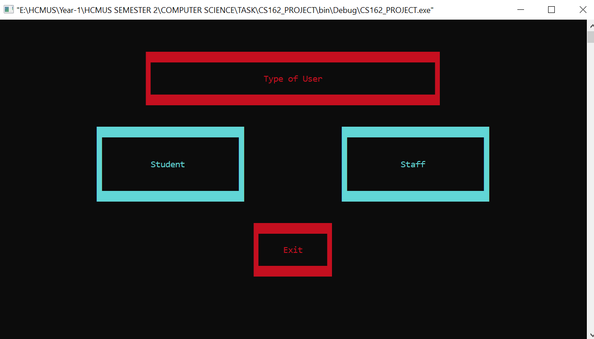
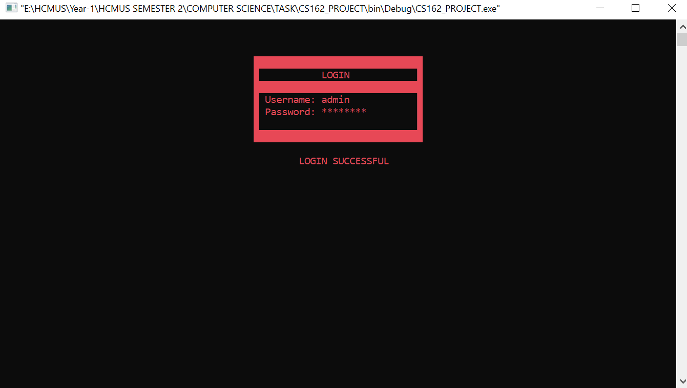
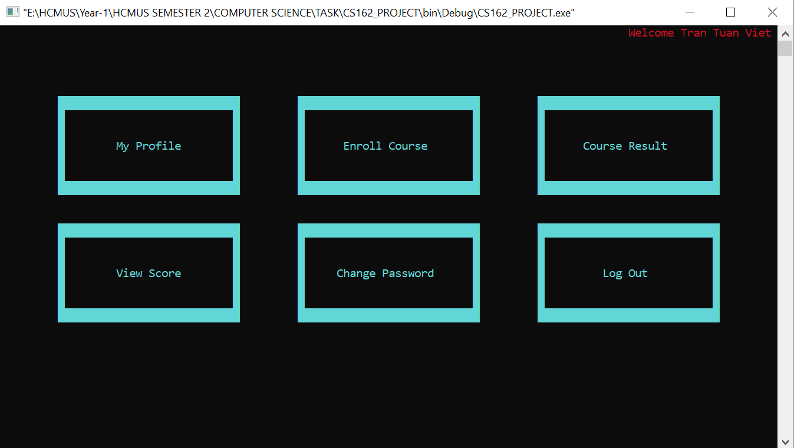
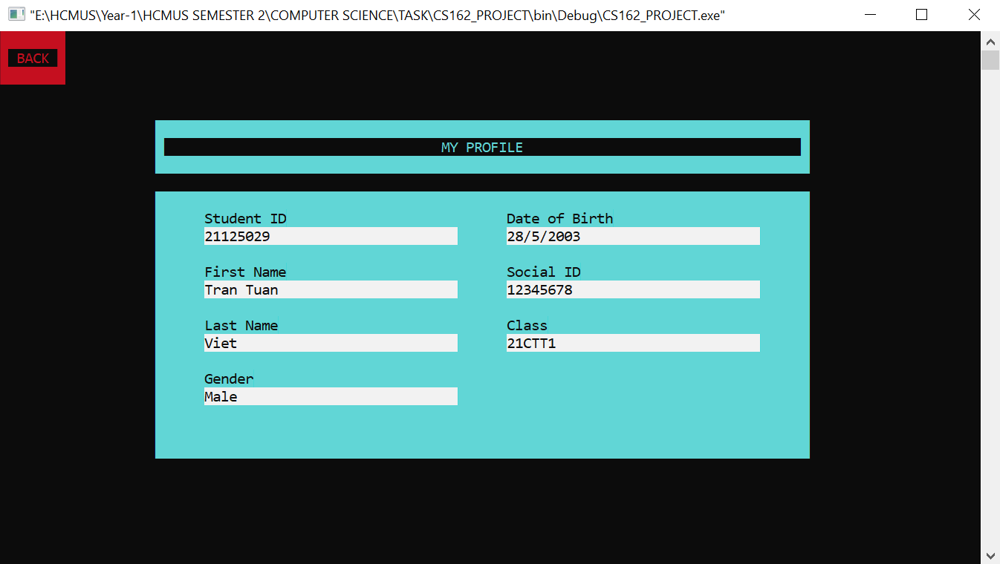
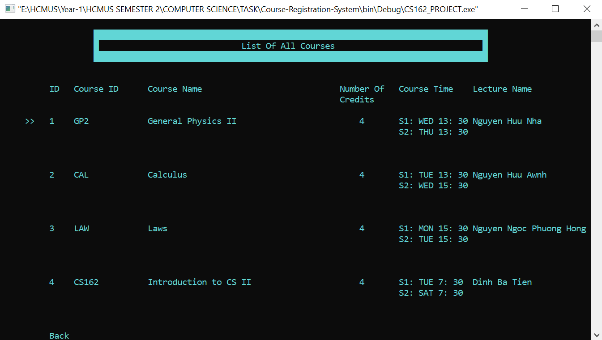

# Course Registration System
This is the Course Registration System created by Student HCMUS-VNU - 21APCS1

## Members
* 21125029 - Tran Tuan Viet

## Description
The system is coded in C++17 using no GUI Library.

In this system, there are 2 types of users: Academic Staff Member and Student. User need to login to system to manage courses or register new courses for new semester.

Academic Staff Member can carry out these tasks:
* View his/her profile
* Create a new school year/semester/classes
* Create a new course registration
* Manage Students
* Manage courses and Student's scores in each courses

When a course registration session is active, a student can:
* View/Check his/her profile
* Enroll in a course. If 2 sessions of the new course are conflicted with existing
enrolled course sessions, he/she can not enroll in it. He/she can enroll in at
most 5 courses in a semester
* View a list of enrolled courses
* Remove a course from the enrolled list
* View his/her Scoreboard

## Getting Started
### Installing
* Clone the project to your computer. 
```
  git clone https://github.com/ttviet2805/Course-Registration-System.git
```

### Executing program
* Using an IDE to compile this game (Codeblocks, Visual Studio, ...)
* Remember to add all source codes to project before building and running

## Usage
* The detail of the Course Registration System is in the [Report.pdf](https://github.com/ttviet2805/Course-Registration-System/blob/master/Report.pdf).
* Download and read [Report.pdf](https://github.com/ttviet2805/Course-Registration-System/blob/master/Report.pdf) to get the general view of our System.

* Choosing User Screen
<div align = "center">
  
</div>

* Login Screen
<div align = "center">
  
</div>

* System Menu Screen
<div align = "center">
  
</div>

* Profile Screen
<div align = "center">
  
</div>

* List of Registration Courses Screen
<div align = "center">
  
</div>

## Contact
Tran Tuan Viet - ttviet2805@gmail.com
